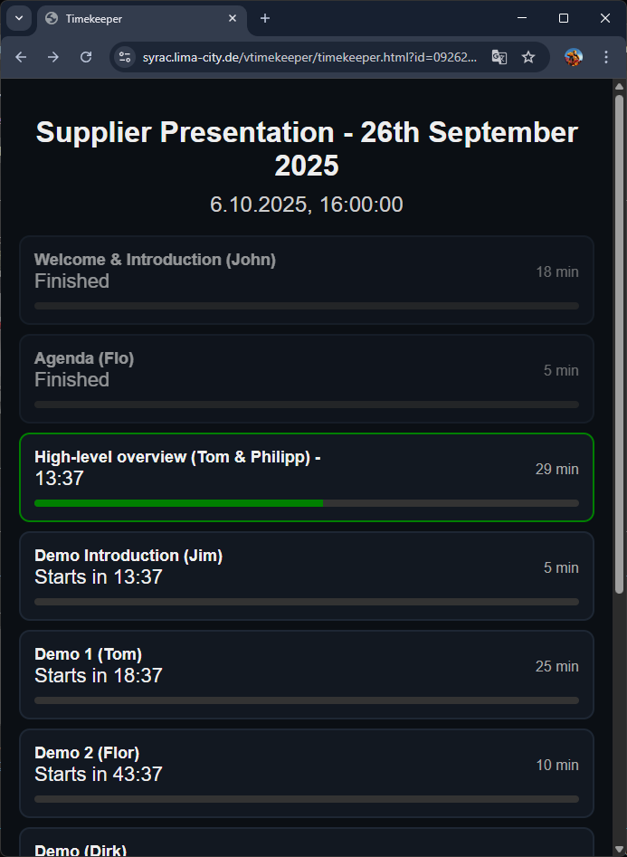

# VTimekeeper

A shared presentation timer for teams and events

🌐 [EN](README.md) | [DE](README_DE.md)

## Overview
VTimekeeper is a simple, shared countdown tool designed for meetings, events, and presentations. Multiple participants can open the same agenda link and watch the timers run in sync.

### Example Agenda View

---

## How to Use
1. **Go to Admin Page:** [https://syrac.lima-city.de/vtimekeeper/admin.html?new=1](https://syrac.lima-city.de/vtimekeeper/admin.html?new=1)
2. **Fill in Title and Start Time (UTC)**
3. **Add Slots** (Title + Duration)
4. **Click 💾 Save Changes**

**A popup will show:**
* 👀 **View Link** – share with viewers
* ✏️ **Admin Link** – edit later

➕ [Create New Agenda](https://syrac.lima-city.de/vtimekeeper/admin.html?new=1) | 👀 [View Example](https://syrac.lima-city.de/vtimekeeper/)

---

## Tips
* **All times are in UTC** – adjust for your timezone.
* **Agendas sync automatically** for all viewers.
* **Keep your Admin Link private.**
* **Create new agendas** for different sessions.

---

Made with ❤️ by [Syrac](https://syrac.lima-city.de)